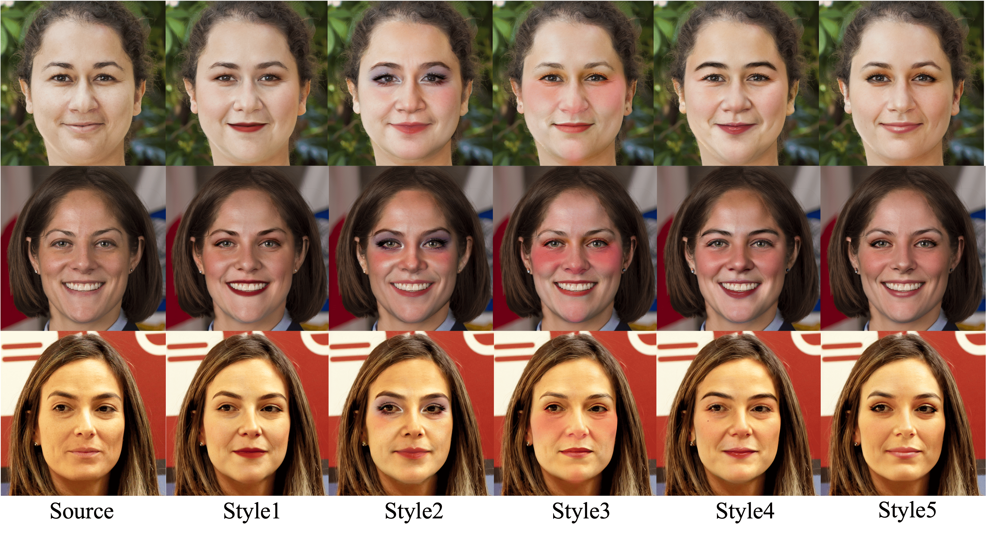

<h1>TinyBeauty: Toward Tiny and High-quality Facial Makeup with Data Amplify Learning</h1>

Our TinyBeauty effectively synthesizes stunning makeup styles with consistent content, enabling seamless video application.

## Release
- [2024/04/03] 🔥 We launch the [project page](https://tinybeauty.github.io/TinyBeauty/).
- [2024/03/22] 🔥 We release the [technical report](https://arxiv.org/abs/2403.15033).

## Demos

### High-quality Facial Makeup

  

Our DDA generates consistent makeup styles while retain the facial content and identity of the original image

  

Facial makeup results on high-resolution (1024*1024) images.

### Comparison with Previous Works

  

Visual comparison of TineBeauty and competing methods on the FFHQ Dataset.

  

Visual comparison of TineBeauty and competing methods on the MT Dataset.

  

Visual comparison of TineBeauty and BeautyREC on challenging out-of-distribution examples

## Usage

### Prepare data
