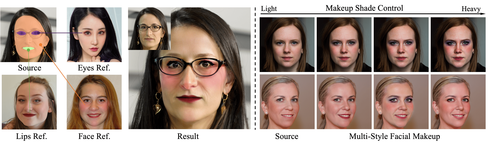

<div align="center">
<h1>TinyBeauty: Toward Tiny and High-quality Facial Makeup with Data Amplify Learning</h1>
<b>Accepted by ECCV2024</b>
  
<a href='https://tinybeauty.github.io/TinyBeauty/'></a>
<a href='https://arxiv.org/abs/2403.15033'></a>
</div>

Our TinyBeauty effectively synthesizes stunning makeup styles with consistent content, enabling seamless video application.



## Release
- [2024/06/02] 🔥 We release the [source code](https://github.com/TinyBeauty/TinyBeauty).
- [2024/04/03] 🔥 We launch the [project page](https://tinybeauty.github.io/TinyBeauty/).
- [2024/03/22] 🔥 We release the [technical report](https://arxiv.org/abs/2403.15033).

## Visual Results

### High-quality Facial Makeup

<p align="center">
  
</p>

Our DDA generates consistent makeup styles while retain the facial content and identity of the original image

<p align="center">
  
</p>
Facial makeup results on high-resolution (1024*1024) images.

### Comparison with Previous Works
<p align="center">
  
</p>

Visual comparison of TineBeauty and competing methods on the FFHQ Dataset.

<p align="center">
  
</p>

Visual comparison of TineBeauty and competing methods on the MT Dataset.

<p align="center">
  
</p>

Visual comparison of TineBeauty and BeautyREC on challenging out-of-distribution examples


## Usage

### Prepare data

Download sample image pair and makeup style template from  [here](https://drive.google.com/file/d/14rEFhVtQbNpBL6tPB49kpOsCF3INX8Wl/view?usp=sharing), and place it in the `./data` folder.

### Finetune

```shell
python SD_finetune.py 
    -m runwayml/stable-diffusion-v1-5
    -e h94/IP-Adapter
    -nonmakeup data/Finetune_Data/train
    -makeup data/Finetune_Data/train_purple
    -o "$LORA_MODEL_SAVE_PATH"
```

### Inference

```shell
python SD_inference.py
    -m "$LORA_MODEL_SAVE_PATH"
    -s data/Finetune_Data/purple.png
    -d data/Finetune_Data/test
    -o res/test1
```

## Cite
If you find TinyBeauty useful for your research and applications, please cite us using this BibTeX:

```bibtex
@misc{jin2024tiny,
      title={Toward Tiny and High-quality Facial Makeup with Data Amplify Learning}, 
      author={Qiaoqiao Jin and Xuanhong Chen and Meiguang Jin and Ying Cheng and Rui Shi and Yucheng Zheng and Yupeng Zhu and Bingbing Ni},
      year={2024},
      eprint={2403.15033},
      archivePrefix={arXiv},
      primaryClass={cs.CV}
}
```
